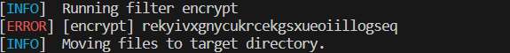
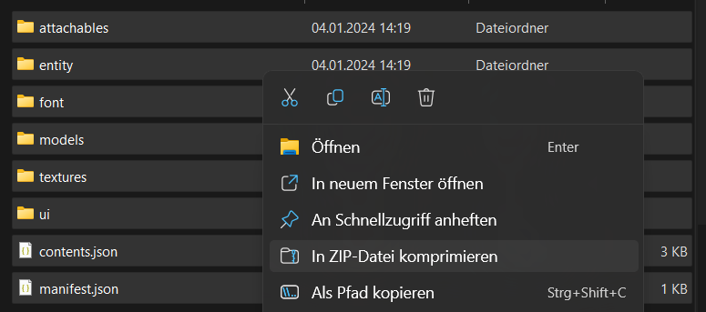
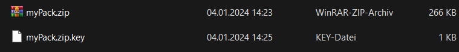

# Pack Encrypt

Pack Encrypt Is A [Regolith Filter](https://bedrock-oss.github.io/regolith/guide/filters) To Automaticly Encrypt RP Packs Using A Build Tool Called Regolith. This Filter Can Be Modified To Work In Other Enviroments Aswell And Should Be Easy To Modify To Work In Any Node Enviroment.

## How It Works
⚠️NOT EVERY SERVER SOFTWARE SUPPORTS ENCRYPTED PACKS AND I AM UNAWARE OF METHODS TO MAKE IT WORK IN WORLDS⚠️

After Runing The Filer The Decryption Key Will Be Displayed In The Console 

Now The Pack Contents Have To Be Zipped Manually.

Now Create A .key File With The Same Name As The Zipped Folder And Put Your Key Inside The File

🎉And Now You Are Ready To Use The Encrypted Pack.

NOTE : ONLY SOME SERVER SOFTWARES SUPPORT ENCRYPTED PACKS
BDS IS NOT ONE OF THEM

| Server Software | Supported Status |
| ----------- | ----------- |
| Nukkit | ✔️ |
| PoketMine | ✔️ |
| WaterDogPE Proxy | ✔️ |
| BDS | ⭕ |
| BDSX | Need To Test But Probably Not |
| LiteLoaderBDS / LeviLamina | Need To Test But Probably Not |

## Without Regolith
Regolith Operates In Temporary Directories. Depending On Your File Structure You Might Wanna Change The Paths. This Program Assumes That It Is Placed From A Place One Above The RP Folder So Build Your File Structure Arround That It Can Access A RP Folder Relative To Its Execution.
